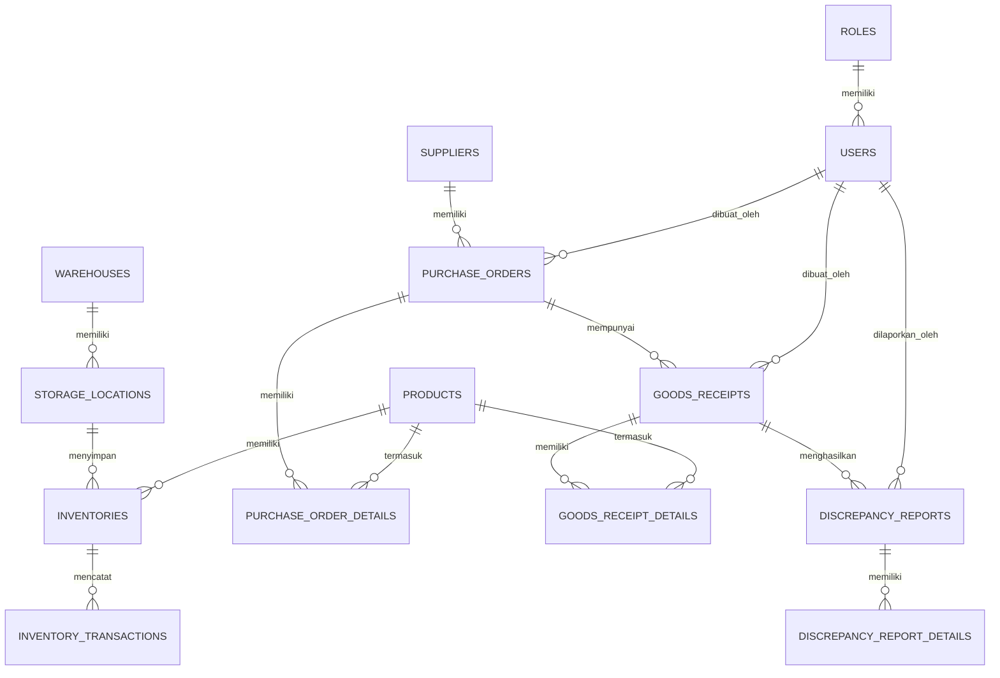

# Skema Database Sistem Manajemen Gudang Retail

## Daftar Tabel

1. [Pengguna (Users)](#pengguna-users)
2. [Peran (Roles)](#peran-roles)
3. [Suplier (Suppliers)](#suplier-suppliers)
4. [Kategori Produk (ProductCategories)](#kategori-produk-productcategories)
5. [Produk (Products)](#produk-products)
6. [Gudang (Warehouses)](#gudang-warehouses)
7. [Lokasi Penyimpanan (StorageLocations)](#lokasi-penyimpanan-storagelocations)
8. [Purchase Order (PurchaseOrders)](#purchase-order-purchaseorders)
9. [Detail PO (PurchaseOrderDetails)](#detail-po-purchaseorderdetails)
10. [Penerimaan Barang (GoodsReceipts)](#penerimaan-barang-goodsreceipts)
11. [Detail Penerimaan (GoodsReceiptDetails)](#detail-penerimaan-goodsreceiptdetails)
12. [Laporan Ketidaksesuaian (DiscrepancyReports)](#laporan-ketidaksesuaian-discrepancyreports)
13. [Detail Ketidaksesuaian (DiscrepancyReportDetails)](#detail-ketidaksesuaian-discrepancyreportdetails)
14. [Stok (Inventories)](#stok-inventories)
15. [Riwayat Stok (InventoryTransactions)](#riwayat-stok-inventorytransactions)

## Pengguna (Users)

| Nama Kolom        | Tipe Data                               | Keterangan                  |
| ----------------- | --------------------------------------- | --------------------------- |
| id                | BIGINT UNSIGNED                         | PRIMARY KEY, AUTO_INCREMENT |
| name              | VARCHAR(255)                            | Nama lengkap pengguna       |
| email             | VARCHAR(255)                            | UNIQUE                      |
| email_verified_at | TIMESTAMP                               | NULLABLE                    |
| password          | VARCHAR(255)                            | Hash kata sandi             |
| role_id           | BIGINT UNSIGNED                         | FOREIGN KEY ke Roles        |
| status            | ENUM('active', 'inactive', 'suspended') | Status akun                 |
| last_login        | TIMESTAMP                               | NULLABLE                    |
| created_at        | TIMESTAMP                               | NULLABLE                    |
| updated_at        | TIMESTAMP                               | NULLABLE                    |

## Peran (Roles)

| Nama Kolom  | Tipe Data       | Keterangan                              |
| ----------- | --------------- | --------------------------------------- |
| id          | BIGINT UNSIGNED | PRIMARY KEY, AUTO_INCREMENT             |
| name        | VARCHAR(255)    | Nama peran (contoh: admin, staf gudang) |
| description | TEXT            | Deskripsi peran                         |
| permissions | JSON            | Daftar permission dalam format JSON     |
| created_at  | TIMESTAMP       | NULLABLE                                |
| updated_at  | TIMESTAMP       | NULLABLE                                |

## Suplier (Suppliers)

| Nama Kolom   | Tipe Data                  | Keterangan                  |
| ------------ | -------------------------- | --------------------------- |
| id           | BIGINT UNSIGNED            | PRIMARY KEY, AUTO_INCREMENT |
| kode_suplier | VARCHAR(50)                | Kode unik suplier           |
| nama         | VARCHAR(255)               | Nama suplier                |
| alamat       | TEXT                       | Alamat lengkap              |
| telepon      | VARCHAR(50)                | Nomor telepon               |
| email        | VARCHAR(255)               | Email kontak                |
| npwp         | VARCHAR(50)                | Nomor NPWP                  |
| status       | ENUM('active', 'inactive') | Status suplier              |
| created_at   | TIMESTAMP                  | NULLABLE                    |
| updated_at   | TIMESTAMP                  | NULLABLE                    |

## Kategori Produk (ProductCategories)

| Nama Kolom | Tipe Data       | Keterangan                  |
| ---------- | --------------- | --------------------------- |
| id         | BIGINT UNSIGNED | PRIMARY KEY, AUTO_INCREMENT |
| nama       | VARCHAR(255)    | Nama kategori               |
| deskripsi  | TEXT            | Deskripsi kategori          |
| created_at | TIMESTAMP       | NULLABLE                    |
| updated_at | TIMESTAMP       | NULLABLE                    |

## Produk (Products)

| Nama Kolom          | Tipe Data                  | Keterangan                       |
| ------------------- | -------------------------- | -------------------------------- |
| id                  | BIGINT UNSIGNED            | PRIMARY KEY, AUTO_INCREMENT      |
| kode_produk         | VARCHAR(50)                | Kode unik produk                 |
| nama                | VARCHAR(255)               | Nama produk                      |
| deskripsi           | TEXT                       | Deskripsi produk                 |
| kategori_id         | BIGINT UNSIGNED            | FOREIGN KEY ke ProductCategories |
| satuan              | VARCHAR(50)                | Satuan (pcs, kg, dll)            |
| stok_minimum        | DECIMAL(10,2)              | Minimal stok sebelum peringatan  |
| stok_maksimum       | DECIMAL(10,2)              | Maksimal stok yang diizinkan     |
| harga_beli_terakhir | DECIMAL(15,2)              | Harga beli terakhir              |
| harga_jual          | DECIMAL(15,2)              | Harga jual                       |
| gambar              | VARCHAR(255)               | Path gambar produk               |
| barcode             | VARCHAR(100)               | Kode barcode                     |
| status              | ENUM('active', 'inactive') | Status produk                    |
| created_at          | TIMESTAMP                  | NULLABLE                         |
| updated_at          | TIMESTAMP                  | NULLABLE                         |

## Gudang (Warehouses)

| Nama Kolom  | Tipe Data                  | Keterangan                  |
| ----------- | -------------------------- | --------------------------- |
| id          | BIGINT UNSIGNED            | PRIMARY KEY, AUTO_INCREMENT |
| kode_gudang | VARCHAR(50)                | Kode unik gudang            |
| nama        | VARCHAR(255)               | Nama gudang                 |
| alamat      | TEXT                       | Alamat gudang               |
| telepon     | VARCHAR(50)                | Nomor telepon gudang        |
| status      | ENUM('active', 'inactive') | Status gudang               |
| created_at  | TIMESTAMP                  | NULLABLE                    |
| updated_at  | TIMESTAMP                  | NULLABLE                    |

## Lokasi Penyimpanan (StorageLocations)

| Nama Kolom  | Tipe Data                  | Keterangan                    |
| ----------- | -------------------------- | ----------------------------- |
| id          | BIGINT UNSIGNED            | PRIMARY KEY, AUTO_INCREMENT   |
| gudang_id   | BIGINT UNSIGNED            | FOREIGN KEY ke Warehouses     |
| kode_lokasi | VARCHAR(50)                | Kode unik lokasi              |
| nama        | VARCHAR(255)               | Nama lokasi                   |
| deskripsi   | TEXT                       | Deskripsi lokasi              |
| kapasitas   | INT                        | Kapasitas maksimal (opsional) |
| status      | ENUM('active', 'inactive') | Status lokasi                 |
| created_at  | TIMESTAMP                  | NULLABLE                      |
| updated_at  | TIMESTAMP                  | NULLABLE                      |

## Purchase Order (PurchaseOrders)

| Nama Kolom         | Tipe Data                                                                                          | Keterangan                     |
| ------------------ | -------------------------------------------------------------------------------------------------- | ------------------------------ |
| id                 | BIGINT UNSIGNED                                                                                    | PRIMARY KEY, AUTO_INCREMENT    |
| nomor_po           | VARCHAR(50)                                                                                        | Nomor PO unik                  |
| suplier_id         | BIGINT UNSIGNED                                                                                    | FOREIGN KEY ke Suppliers       |
| tanggal_po         | DATE                                                                                               | Tanggal pembuatan PO           |
| tanggal_dibutuhkan | DATE                                                                                               | Tanggal dibutuhkan             |
| status             | ENUM('draft', 'submitted', 'approved', 'rejected', 'partially_received', 'completed', 'cancelled') | Status PO                      |
| catatan            | TEXT                                                                                               | Catatan tambahan               |
| dibuat_oleh        | BIGINT UNSIGNED                                                                                    | FOREIGN KEY ke Users           |
| disetujui_oleh     | BIGINT UNSIGNED                                                                                    | NULLABLE, FOREIGN KEY ke Users |
| tanggal_disetujui  | TIMESTAMP                                                                                          | NULLABLE                       |
| created_at         | TIMESTAMP                                                                                          | NULLABLE                       |
| updated_at         | TIMESTAMP                                                                                          | NULLABLE                       |

## Detail PO (PurchaseOrderDetails)

| Nama Kolom   | Tipe Data       | Keterangan                    |
| ------------ | --------------- | ----------------------------- |
| id           | BIGINT UNSIGNED | PRIMARY KEY, AUTO_INCREMENT   |
| po_id        | BIGINT UNSIGNED | FOREIGN KEY ke PurchaseOrders |
| produk_id    | BIGINT UNSIGNED | FOREIGN KEY ke Products       |
| kuantitas    | DECIMAL(10,2)   | Jumlah pesanan                |
| harga_satuan | DECIMAL(15,2)   | Harga per satuan              |
| subtotal     | DECIMAL(15,2)   | Kuantitas x Harga Satuan      |
| diterima     | DECIMAL(10,2)   | Jumlah yang sudah diterima    |
| sisa         | DECIMAL(10,2)   | Sisa yang belum diterima      |
| created_at   | TIMESTAMP       | NULLABLE                      |
| updated_at   | TIMESTAMP       | NULLABLE                      |

## Penerimaan Barang (GoodsReceipts)

| Nama Kolom     | Tipe Data                               | Keterangan                    |
| -------------- | --------------------------------------- | ----------------------------- |
| id             | BIGINT UNSIGNED                         | PRIMARY KEY, AUTO_INCREMENT   |
| nomor_grn      | VARCHAR(50)                             | Nomor GRN unik                |
| po_id          | BIGINT UNSIGNED                         | FOREIGN KEY ke PurchaseOrders |
| tanggal_terima | DATETIME                                | Tanggal penerimaan            |
| suplier_id     | BIGINT UNSIGNED                         | FOREIGN KEY ke Suppliers      |
| surat_jalan    | VARCHAR(100)                            | Nomor surat jalan             |
| pengirim       | VARCHAR(255)                            | Nama pengirim                 |
| catatan        | TEXT                                    | Catatan tambahan              |
| status         | ENUM('draft', 'completed', 'cancelled') | Status GRN                    |
| dibuat_oleh    | BIGINT UNSIGNED                         | FOREIGN KEY ke Users          |
| created_at     | TIMESTAMP                               | NULLABLE                      |
| updated_at     | TIMESTAMP                               | NULLABLE                      |

## Detail Penerimaan (GoodsReceiptDetails)

| Nama Kolom         | Tipe Data                    | Keterangan                          |
| ------------------ | ---------------------------- | ----------------------------------- |
| id                 | BIGINT UNSIGNED              | PRIMARY KEY, AUTO_INCREMENT         |
| goods_receipt_id   | BIGINT UNSIGNED              | FOREIGN KEY ke GoodsReceipts        |
| product_id         | BIGINT UNSIGNED              | FOREIGN KEY ke Products             |
| po_detail_id       | BIGINT UNSIGNED              | FOREIGN KEY ke PurchaseOrderDetails |
| kuantitas_dipesan  | DECIMAL(10,2)                | Jumlah yang dipesan                 |
| kuantitas_diterima | DECIMAL(10,2)                | Jumlah yang diterima                |
| kuantitas_ditolak  | DECIMAL(10,2)                | Jumlah yang ditolak                 |
| alasan_penolakan   | TEXT                         | Alasan penolakan                    |
| lokasi_id          | BIGINT UNSIGNED              | FOREIGN KEY ke StorageLocations     |
| status             | ENUM('pending', 'completed') | Status penerimaan                   |
| created_at         | TIMESTAMP                    | NULLABLE                            |
| updated_at         | TIMESTAMP                    | NULLABLE                            |

## Laporan Ketidaksesuaian (DiscrepancyReports)

| Nama Kolom        | Tipe Data                                                       | Keterangan                     |
| ----------------- | --------------------------------------------------------------- | ------------------------------ |
| id                | BIGINT UNSIGNED                                                 | PRIMARY KEY, AUTO_INCREMENT    |
| nomor_laporan     | VARCHAR(50)                                                     | Nomor laporan unik             |
| goods_receipt_id  | BIGINT UNSIGNED                                                 | FOREIGN KEY ke GoodsReceipts   |
| dilaporkan_oleh   | BIGINT UNSIGNED                                                 | FOREIGN KEY ke Users           |
| tanggal_laporan   | DATE                                                            | Tanggal laporan                |
| status            | ENUM('draft', 'submitted', 'in_review', 'resolved', 'rejected') | Status laporan                 |
| catatan           | TEXT                                                            | Catatan tambahan               |
| tindakan          | TEXT                                                            | Tindakan yang diambil          |
| diselesaikan_oleh | BIGINT UNSIGNED                                                 | NULLABLE, FOREIGN KEY ke Users |
| tanggal_selesai   | DATE                                                            | NULLABLE                       |
| created_at        | TIMESTAMP                                                       | NULLABLE                       |
| updated_at        | TIMESTAMP                                                       | NULLABLE                       |

## Detail Ketidaksesuaian (DiscrepancyReportDetails)

| Nama Kolom    | Tipe Data                                               | Keterangan                        |
| ------------- | ------------------------------------------------------- | --------------------------------- |
| id            | BIGINT UNSIGNED                                         | PRIMARY KEY, AUTO_INCREMENT       |
| report_id     | BIGINT UNSIGNED                                         | FOREIGN KEY ke DiscrepancyReports |
| product_id    | BIGINT UNSIGNED                                         | FOREIGN KEY ke Products           |
| kuantitas     | DECIMAL(10,2)                                           | Jumlah yang bermasalah            |
| jenis_masalah | ENUM('rusak', 'tidak_sesuai', 'kedaluwarsa', 'lainnya') | Jenis masalah                     |
| deskripsi     | TEXT                                                    | Deskripsi masalah                 |
| bukti_gambar  | VARCHAR(255)                                            | Path gambar bukti                 |
| created_at    | TIMESTAMP                                               | NULLABLE                          |
| updated_at    | TIMESTAMP                                               | NULLABLE                          |

## Stok (Inventories)

| Nama Kolom   | Tipe Data       | Keterangan                      |
| ------------ | --------------- | ------------------------------- |
| id           | BIGINT UNSIGNED | PRIMARY KEY, AUTO_INCREMENT     |
| product_id   | BIGINT UNSIGNED | FOREIGN KEY ke Products         |
| location_id  | BIGINT UNSIGNED | FOREIGN KEY ke StorageLocations |
| kuantitas    | DECIMAL(10,2)   | Jumlah stok tersedia            |
| batch_number | VARCHAR(100)    | Nomor batch (opsional)          |
| expired_date | DATE            | Tanggal kedaluwarsa (opsional)  |
| created_at   | TIMESTAMP       | NULLABLE                        |
| updated_at   | TIMESTAMP       | NULLABLE                        |

## Riwayat Stok (InventoryTransactions)

| Nama Kolom       | Tipe Data                             | Keterangan                                         |
| ---------------- | ------------------------------------- | -------------------------------------------------- |
| id               | BIGINT UNSIGNED                       | PRIMARY KEY, AUTO_INCREMENT                        |
| inventory_id     | BIGINT UNSIGNED                       | FOREIGN KEY ke Inventories                         |
| transaction_type | ENUM('masuk', 'keluar', 'adjustment') | Jenis transaksi                                    |
| quantity         | DECIMAL(10,2)                         | Jumlah transaksi                                   |
| reference_type   | VARCHAR(50)                           | Tipe referensi (contoh: 'GRN', 'SO', 'Adjustment') |
| reference_id     | BIGINT UNSIGNED                       | ID referensi                                       |
| catatan          | TEXT                                  | Catatan transaksi                                  |
| created_by       | BIGINT UNSIGNED                       | FOREIGN KEY ke Users                               |
| created_at       | TIMESTAMP                             | NULLABLE                                           |

## Relasi Tabel

## Indeks yang Direkomendasikan

1. `idx_products_kode` ON `products` (`kode_produk`)
2. `idx_products_barcode` ON `products` (`barcode`)
3. `idx_po_nomor` ON `purchase_orders` (`nomor_po`)
4. `idx_po_status` ON `purchase_orders` (`status`)
5. `idx_grn_nomor` ON `goods_receipts` (`nomor_grn`)
6. `idx_inventory_product` ON `inventories` (`product_id`)
7. `idx_inventory_location` ON `inventories` (`location_id`)

8. Semua tabel menggunakan `created_at` dan `updated_at` untuk pelacakan waktu pembuatan dan pembaruan.
9. Gunakan soft delete dengan menambahkan kolom `deleted_at` pada tabel yang membutuhkan fitur penghapusan.
10. Pertimbangkan untuk menambahkan trigger untuk menghitung nilai `subtotal` pada tabel `purchase_order_details`.
11. Buat view untuk laporan yang sering diakses seperti stok saat ini, riwayat transaksi, dan laporan kinerja.
